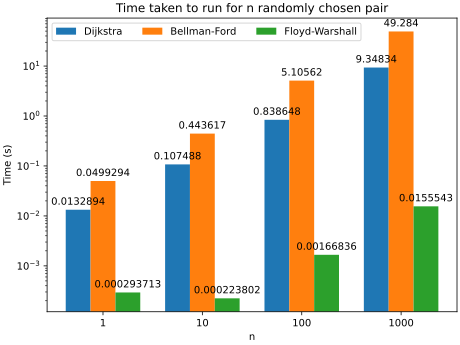

# Performance test for shortest-path algorithm

## Floyd-Warshall and the need to use pre-processed result

Floyd-Warshall algorithm finds the shortest path between every pair of vertices within the graph. It
works with directed/undirected graph and tolerates negative edge weight, with the ability to detect
negative cycles. For our purpose (road network with only non-negative weight), we will not care
about negative cycles.

This algorithm has time complexity of O(V^3), meaning that for every doubling in vertex count, the
time taken to run increases by 8 times. This means that this algorithm is unsuitable for very large
graph, or dynamic graph in which the weight changes frequently.

> [!NOTE]
> Pre-process the routing result in `floyd-warshall-preprocess.py`, save the predecessors and 
> distances result JSON files (`data/fw-dists.json` and `data/fw-preds.json`). This takes very long
> on my machine for the road network of Quận 1 + Quận 3 (~9700 seconds). So I recommend using the
> pre-processed result within the JSON files.

> [!NOTE]
> The pre-processed result is quite big (total to about 900 MB), so it will be provided within a ZIP
> compressed file (`data/fw-preds-dists.zip`) to decrease capacity usage for GitHub.

## Timing (performance) result of three algorithms

Take note that the Floyd-Warshall algorithm is running on pre-processed result, and thus is the
fastest of the bunch. Dijkstra comes in second place and is still pretty fast. The slowest is
Bellman-Ford, with its application for non-negative weight graph results in its losing out Dijkstra.

The take-away is clear, Dijkstra is generally the fastest for graph with non-negative weight. If
there is a chance of negative cycle, then use Bellman-Ford. Floyd-Warshall is reserved for very
small graphs or graphs that change very infrequently, due to its slower nature.

We can perform simple calculation to know the amount of routing needed to amortize pre-processing
time of Floyd-Warshall. Given that Floyd-Warshall pre-processing takes about 9700s, and the time
save each 1000 routing is about 

$$
9.34 - 0.015 = 9.325(s),
$$

the minimum number of routing need such that total processing time is equal between Dijkstra and 
Floyd-Warshall is

$$
\frac{9700}{9.325} * 1000 \approx 1.04 * 10^6.
$$

So, it requires about _one million_ routing request to make Floyd-Warshall be faster and Dijkstra.
