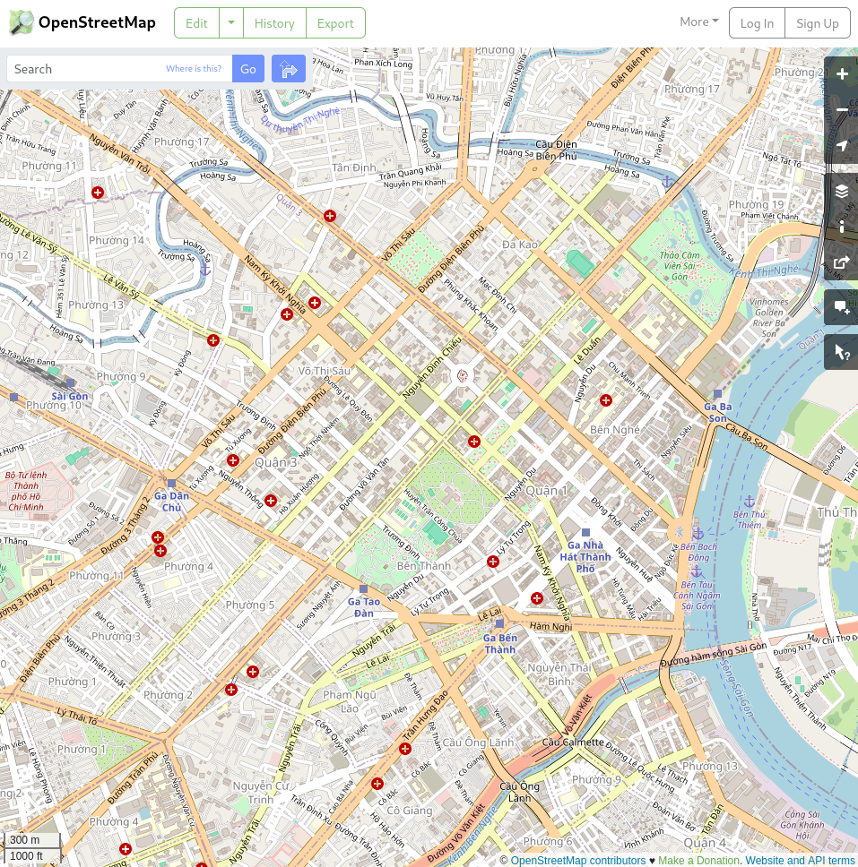
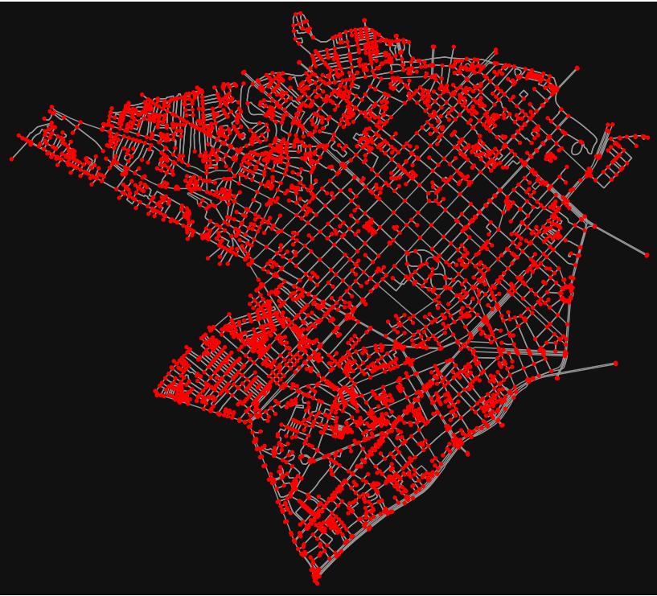

# Graph data collection

## Decision: Google Maps vs. OpenStreetMap

Within the scope of this project, we have tried to evaluate two sources of map data - Google Maps
and OpenStreetMap. We found the following:

- Google Maps: Google's data is remarkably detailed, but is blocked behind paywall. That is to be
expected when those data cost a lot of money to generate, to maintain and to be kept accurate. Those
data can somewhat be accessed through Google Maps' various API. But the main point to be stressed
here is that _Google Maps data usage is not free and freely available_. If there is any doubt in
this, refer to Google Maps Platform Terms of Service [^gmap-tos] to see that scraping of the data is
against terms of service.

- OpenStreetMap: Open and free like its namesake. Its accuracy is good enough for our purpose. And
there exists associated tooling OSMnx [@osm:intro-paper; @osm:intro-paper-more] for supporting
fetching, simplifying and cleaning the data for later use.

Due to the closed off nature of the Google Maps platform, our groups have decided to go with
OpenStreetMap data and its related applications, particularly using OSMnx.

[^gmap-tos]: Found at <https://cloud.google.com/maps-platform/terms>, subsection 3.2.3 for various
    restrictions of using the service.

## About OpenStreetMap

{width=70%}

Taken from [@enwiki:osm].

OpenStreetMap (OSM) is a free, open geographic database updated and maintained by a community of
volunteers via open collaboration. Contributors collect data from surveys, trace from aerial imagery
and also import from other freely licensed geodata sources. OpenStreetMap is freely licensed under
the Open Database License and as a result commonly used to make electronic maps, inform turn-by-turn
navigation, assist in humanitarian aid and data visualisation. OpenStreetMap uses its own topology
to store geographical features which can then be exported into other GIS file formats. The
OpenStreetMap website itself is an online map, geodata search engine and editor.

OpenStreetMap was created by Steve Coast in response to the Ordnance Survey, the United Kingdom's
national mapping agency, failing to release its data to the public under free licences in 2004.
Initially, maps were created only via GPS traces, but it was quickly populated by importing public
domain geographical data such as the U.S. TIGER and by tracing permitted aerial photography or
satellite imagery. OpenStreetMap's adoption was accelerated by Google Maps's introduction of pricing
in 2012 and the development of supporting software and applications.

The database is hosted by the OpenStreetMap Foundation, a non-profit organisation registered in
England and Wales and is funded mostly via donations. Meta (formerly Facebook) launched its
distribution called Daylight, based on OSM in 2020. The Linux Foundation's Overture Maps Foundation
released their first open map data based on OSM and other sources in July 2023.

## OpenStreetMap's data structure

Taken from [@enwiki:osm]. Rechecked with [@osmwiki:elements].

OpenStreetMap uses a topological data structure, with four core elements (also known as data
primitives):

![An illustration of basic OSM data primitives (nodes, way and relations). By CactiStaccingCrane. Found on [@enwiki:osm]. CC-BY 4.0](./img/osm-data-primitives.png){width=70%}

- Nodes are points with a geographic position, stored as coordinates (pairs of a latitude and a
longitude) according to WGS 84. Each node comprises at least an _id number and a pair of
coordinates_.

- Ways are ordered lists of nodes, representing a polyline, or possibly a polygon if they form a
closed loop. They are used both for representing linear features such as streets and rivers, and
areas, like forests, parks, parking areas and lakes.

- Relations are ordered lists of nodes, ways and relations (together called "members"), where each
member can optionally have a "role" (a string). Relations are used for representing the relationship
of existing nodes and ways. Examples include turn restrictions on roads, routes that span several
existing ways (for instance, a long-distance motorway), and areas with holes.

- Tags are key-value pairs (both arbitrary strings). They are used to store metadata about the map
objects (such as their type, their name and their physical properties). Tags are not freestanding,
but are always attached to an object: to a node, a way or a relation.

## Attaining map data with OSMnx

The Python script fetching map data can be found in our group GitHub repository[^github]. It require
that OSMnx has been installed within a virtual environment and can be import from within the Python
script. OSMnx will automatically fetch the data through the OpenStreetMap's Overpass API.

> **WARNING**
> The Open Street Map (OSM) data is free for every one to use, but the hosting is not. So use the
> Overpass API with discretion (and remember that you will be rate-limited).

The script name is `retrieve_graph.py`. Running this file will fetch data from the Overpass API for
District 1 and 3 of HCM. The road map is then constructed through various step (showing useless
point, simplify by discarding useless point). Then finally the road network is saved into a GraphML
file for use later.

Plot will be showed in this order:

- Road network before simplify (Fig.\ref{fig:unsimplified-map})

{width=90%}

- Road network after simplify (Fig.\ref{fig:simplified-map})

{width=90%}

- Road network with one-way street highlighted (Fig.\ref{fig:map-oneway-street-highlighted})

{width=90%}

The road network data will be stored as a GraphML file in the `data` folder. Future use can utilize
this data without re-constructing their own to save bandwidth for OSM.

[^github]: <https://github.com/ntpt7921/CSMathFoundation_BigAssignment/tree/main/MapGraph>
